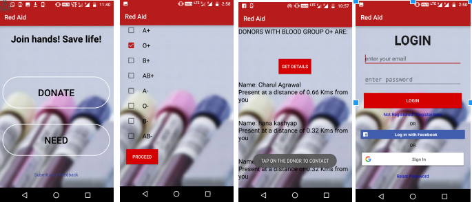

# Red_Aid
Blood Donation Android Application (Summer Internship 2017 Project)

* The application is based on providing the facility of blood in urgency. It contains two
  sections:
  * Donate
  * Need
  People who want to donate blood can anytime register themselves.The app informs the
	registered donors whenever their blood is needed. The app is made keeping in mind the
	distance factor between donor and the needer. Only those donors are informed who lie
	within a particular range of the needer.
  
* **DONATE**- This part of the app contains the profile of the donor and also displays the
  current location of the donor on the Google maps. User needs to turn on the GPS service
  in the phone to get his/her location and the nearby hospitals where he/she can go to 
  donate blood.
  
* **NEED**- If there is a donor which has the same blood group as needed as well as lie within
  10kms of range, then that person’s name and distance are displayed. You can tap the details
  of the donor to contact via sms displaying the message that the person in need wants to send
  ( for example details of the place and time).
  
